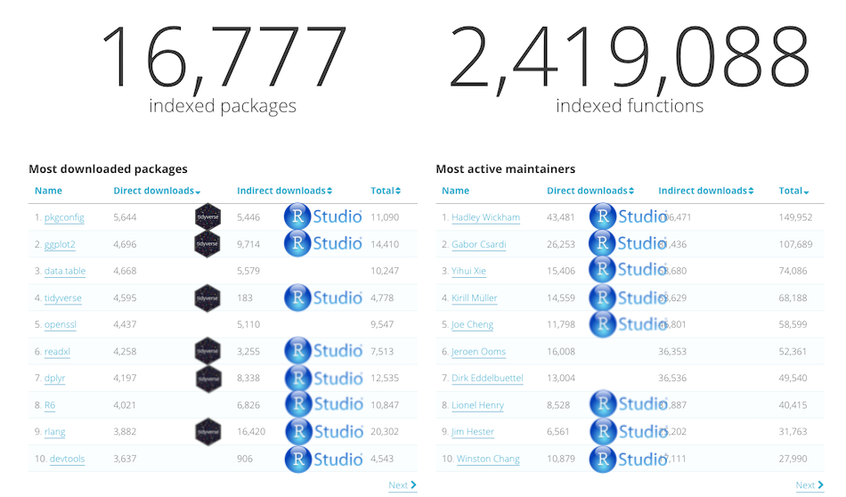

```{r setup, include = FALSE}
knitr::opts_chunk$set(fig.align = "center")
ggplot2::theme_set(ggplot2::theme_bw(14))
library(tidyverse)
```


```{css, echo = FALSE}
.center-pic img {
  display: block;
  margin: auto;
  margin-top: 5px;
  margin-bottom:5px;
}

.center-pic .caption {
  text-align: center;
}
```


## Goals for today {.vs2}

### session 0 {.box-8 .offset-2 .intro .outline}

- reminders
    + about the _tidyverse_
    + tidy data
    + **R** base
- prepare for next week
    + case study on the `gapminder` dataset
    + interactive session

## Tidyverse workflow | David Robinson {.nvs1}

### {.col-10 .offset-1 .center-pic}


## Tidyverse, packages in processes | https://www.tidyverse.org/ {.center-img}


## Tidyverse components  | core / extended {.nvs1}

### Core {.box-6 .intro}

- `ggplot2`, for data visualization
- `dplyr`, for data manipulation
- `tidyr`, for data tidying
- `readr`, for data import
- `purrr`, for functional programming
- `tibble`, for tibbles, a modern re-imagining of data frames


<span class = "small"> source: http://tidyverse.tidyverse.org/. H.Wickham</span> 

### Extended {.box-6 .practical}

- Working with specific types of vectors:
    + `hms`, for times
    + `stringr`, for strings
    + `lubridate`, for date/times
    + `forcats`, for factors

- Importing other types of data:
    + `feather`, for sharing data
    + `haven`, for SPSS, SAS and Stata files
    + `httr`, for web apis
    + `jsonlite` for JSON
    + `readxl`, for `.xls` and `.xlsx` files
    + `rvest`, for web scraping
    + `xml2`, for XML files

- Modelling
    + `modelr`, for modelling within a pipeline
    + `broom`, for models -> tidy data


## Tidyverse criticism  | dialect {.vs3}

<blockquote class="twitter-tweet" data-lang="fr"><p lang="en" dir="ltr"><a href="https://twitter.com/ucfagls">@ucfagls</a> yeah. I think the tidyverse is a dialect. But its accent isn’t so thick</p>&mdash; Hadley Wickham (@hadleywickham) <a href="https://twitter.com/hadleywickham/status/819610201946984451">12 janvier 2017</a></blockquote>
<script async src="https://platform.twitter.com/widgets.js" charset="utf-8"></script>


## Tidyverse criticism | controversy {.vs2}

- [In StackOverflow's comment](http://stackoverflow.com/questions/41880796/grouped-multicolumn-gather-with-dplyr-tidyr-purrr)


- See the popularity of the [data.table versus dplyr](http://stackoverflow.com/questions/21435339/data-table-vs-dplyr-can-one-do-something-well-the-other-cant-or-does-poorly) question.

### Easily summarized {.offset-2 .box-8 .bg-yellow}

[`data.table`](https://github.com/Rdatatable/data.table/wiki) is faster, for less than 10 m rows, negligible.


## Tidyverse criticism  | jobs {.vs2}

<blockquote class="twitter-tweet" data-lang="fr"><p lang="en" dir="ltr">Realized today: <a href="https://twitter.com/hashtag/tidyverse?src=hash">#tidyverse</a> R and base <a href="https://twitter.com/hashtag/rstats?src=hash">#rstats</a> have little in common. Beware when looking for  job which requires knowledge of R.</p>&mdash; Yeedle N. (@Yeedle) <a href="https://twitter.com/Yeedle/status/837448170963668992">2 mars 2017</a></blockquote>
<script async src="https://platform.twitter.com/widgets.js" charset="utf-8"></script>

### Personal complains {.box-12 .warning .outline}

- still young so change quickly and drastically. Backward compatibility is not always maintained.
- `tibbles` are nice but a lot of non-tidyverse packages require `matrices`. `rownames` still an issue.

Anyway, learning the _tidyverse_ does not prevent to learn _R base_, it helps to get things done early in the process

%end%

## Tidyverse  | trends


### {.offset-4 .col-6 }

<span class="small">source: [rdocumentation](https://www.rdocumentation.org/trends) (2019-02-19)</span>


## Tidyverse | trends 



### {.col-6 .offset-4} 

<span class="small">source: [rdocumentation](https://www.rdocumentation.org/trends) (2019-02-19)</span>

## Pipes with magrittr | developed by Stefan Milton Bache {.build}

### compare the approaches {.show .icon .box-6 .offset-3 .practical .outline}


 - classic parenthesis syntax
 - [magrittr](https://cran.r-project.org/web/packages/magrittr/vignettes/magrittr.html) pipeline

### R base {.code .outline .box-6}

```{r}
set.seed(12)
round(mean(rnorm(5)), 2)
```

### magrittr {.advice .outline .box-6}

```{r}
set.seed(12)
rnorm(5) %>%
  mean() %>%
  round(2)
```

Of note, `magrittr` needs to loaded with either:

```{r, eval = FALSE}
library(magrittr)
library(dplyr)
library(tidyverse)
```

%end%

# tidy data


## Learning objectives {.vs2}

### Definitions {.box-8 .offset-2 .intro .icon-small}


+ Principles of *tidy data* to structure data
+ Find errors in existing data sets
+ Structure data
+ Reshaping data with tidyr


### Comments {.box-8 .offset-2 .advice .outline }
+ Cleaning data also requires `dplyr`
+ `tidyr` and `dplyr` are intertwined
+ Focus on "tidy data" 
+ Introduction of `tidyr` ways


## Basic: everything in the data rectangle | with header

### {.col-9}


### {.col-3}

<span class="small">[Jenny Bryan](https://speakerdeck.com/jennybc/data-rectangling) in Jeff Leek [blog post](https://simplystatistics.org/2017/05/24/toward-tidy-analysis/)</span>


## Rationale {.vs3}


> All happy families are alike; each unhappy family is unhappy in its own way. | Leo Tolstoy, Anna Karenina

## Semantics {.vs2}

### Definitions {.box-8 .offset-2 .intro}

+ **Variable**: A quantity, quality, or property that you can measure.
+ **Observation**: A set of values that display the relationship between variables. To be an observation, values need to be measured under similar conditions, usually measured on the same observational unit at the same time.
+ **Value**: The state of a variable that you observe when you measure it.

<span class = "small">[source: Garret Grolemund](http://garrettgman.github.io/tidying/) and `vignette("tidy-data")`</span> 


## Definition {.vs2}

### Tidy data {.box-8 .offset-2 .intro}

1. Each variable is in its own column
2. Each observation is in its own row
3. Each value is in its own cell


## Convert Long / wide format {.vs1}

The wide format is generally untidy _but_ found in the majority of datasets


## Animation | by Garrick Aden-Buie {.vs3}

### {.col-6}


### {.col-6 .middle}

<span class = "small">image from [Garrick Aden-Buie, github repo](https://github.com/gadenbuie/tidy-animated-verbs/#tidy-data)</span> 

## Demo with the iris dataset | gather {.build}

```{r, class = "show", width = 8}
head(iris, 3)
```

### **untidy!** {.box-4 .warning .outline .middle}

4 measurements in columns

%end%

```{r, message=FALSE, warning=FALSE, width = 8}
library("tidyverse")
iris_melt <- iris %>%
  rownames_to_column(var = "number") %>%
  as_tibble() %>%
  gather(flower, measure, contains("al"))
iris_melt
```

### **tidy** {.box-4 .intro .outline .middle}

Each variable in its own column


## Demo with the iris dataset | spread {.vs2}


```{r}
iris_melt %>%
  spread(flower, measure)
```


## Why tidy is useful?

```{r, out.width='50%'}
iris %>%
  gather(flower, measure, -Species) %>%
  ggplot() +
  geom_boxplot(aes(x = Species, y = measure, fill = flower))
```

# Functional programming

## Learning objectives {.intro}

### You will learn to: {.box-10 .offset-1 .intro .outline .icon}


- use a functional programming approach to simplify your code
- pass functions as arguments to higher order functions
- use `purrr::map` to replace `for` loops
- use `purrr::map` together with **nested tibbles**

## Reminder | vector & list

### Atomic vectors{.offset-2 .box-8 .intro .outline}

Each **atomic** vector contains only a single type of data

- The type of each atom is the same
- The size of each atom is 1 (single element)

%end%

```{r, title = "Example", width = 8, class = "offset-2", row = c(6, 6)}
# Logical
c(TRUE, FALSE, TRUE)

# double
c(1, 5, 7)

# character
c("character", "sequence")
```

## Reminder | vector & list

### Coercion {.box-6 .intro .outline .offset-3}

- Is the conversion between types
- Can be
    + **explicit** (using `as.*()` functions)
    + **implicit**

%end%

```{r, title = "Explicit", width = 6}
v_example <- c(1, 3, 7)
str(as.character(v_example))
```

```{r, title = "Implicit", width = 6}
v_example <- c(1, 3)
str(v_example)
str(c(v_example, "seven"))
```

<span class = "small">Adapted from the tutorial of [Jennifer Bryan](https://Jenniferbc.github.io/purrr-tutorial/bk00_vectors-and-lists.html)</span>

## Reminder | vector & list

### Lists {.box-6 .offset-3 .intro .outline}

- are **vectors** which are **not atomic**.
  + Elements can be of different types
  + The length of each element (atom) might be greater than 1.
  
%end%

```{r, title = "Example", width = 8, row = c(7, 5), class = "offset-2"}
my_list <- list(1, 3, "seven")
str(my_list)
is.vector(my_list)
is.atomic(my_list)
```

<span class = "small">Adapted from the tutorial of [Jennifer Bryan](https://Jenniferbc.github.io/purrr-tutorial/bk00_vectors-and-lists.html)</span>

## Reminder | functions {.build}

### Declared function {.box-6 .intro .outline .stretch .show}

```{r, include = FALSE}
# Clean up the global environment
rm(list = ls())
```


```{r}
my_function <- function(my_argument) {
  my_argument + 1
}
```

- is defined in the global environment
    ```{r}
    ls()
    ls.str()
    ```

- is reusable
    ```{r}
    my_function(2)
    ```

### Anonymous functions {.box-6 .intro .outline}

- Are not stored in an object and are used "on the fly"

```{r}
(function(x) { x + 1 })(2)
```
- Does not alter the global environment
    ```{r}
    ls()
    # remove the previous my_function to convince you
    rm(my_function)
    (function(x) { x + 1 })(2)
    ls()
    ```

# Purrr


## Purrr | functional programming


### Overview {.box-8 .offset-2 .intro .outline .icon}


purrr enhances R's **functional programming** toolkit by providing a complete and consistent set of tools for **working with functions and vectors** (`purrr` overview on github page)

### {.col-10 .offset-1 .build}

> **functional programming** is a programming paradigm -- a style of building the structure and elements of computer programs -- that treats computation as the evaluation of mathematical functions and avoids changing-state and mutable data | Wikipedia {.intro}

## Purrr | focuses on functions {.build}

### functional programming features {.box-8 .offset-2 .intro .outline .show}

- pass functions as arguments to other functions
- code that does not change state (a same call should yield the same result)

### Use it for iterations {.box-8 .offset-2 .intro .outline}

FOR EACH `x` DO `f`

## Iteration | the LEGO example

```{css, echo = FALSE}
.my-flex {
  display: flex;
}

.my-flex .caption {
  text-align: center;
}

.my-flex img {
  display: block;
  margin-left: auto;
  margin-right: auto;
}

#lego-single {
  margin-bottom: 20px;
}
```

### Consider a hypothetic `put_on` function {.box-8 .offset-2 .intro .outline}

```{r lego-single, eval = FALSE}
put_on(x, antenna)
```


<div class = "my-flex build">
<div class = "col-4">

</div>
<div class = "col-4">

</div>
<div class = "col-4">

</div>
</div>


## Iteration | the LEGO example {.build}

### Illustration {.box-12 .intro .outline .center-pic .show}

<div class = "my-flex build">
<div class = "col-5">

</div>

<div class = "col-2">

</div>

<div class = "col-5">

</div>
</div>

<span class = "x-small">[LEGO pictures from Jennifer Bryan](https://github.com/Jenniferbc/lego-rstats)</span>

%end%

```{r, eval = FALSE, title = "for loop approach", width = 6}
out <- vector("list", length(legos))
for (i in seq_along(legos)) {
  out[[i]] <- put_on(legos[[i]], antenna)
}
out
```

```{r, eval = FALSE, title = "functional programming approach", width = 6, class = "stretch"}
antennate <- function(x) put_on(x, antenna)
map(legos, antennate)
```

## Your turn {.slide-practical}

### Reminder {.box-8 .offset-2 .intro .outline}

- a data frame is a list
    ```{r}
    is.list(mtcars)
    ```
- Each column represents an element of the list _i.e._ a **data frame is a list of columns**

### Exercise {.box-6 .offset-3 .practical .outline .icon-small}


Calculate the mean of each column of the `mtcars` dataset.

## Your turn {.slide-practical .build}

```{r, title = "Using `purrr::map()`", row = c(7, 5), class = "compact-output show"}
map(mtcars, mean) %>%
  str()
```


```{r, title = "`for` loops", row = c(7, 5), class = "compact-output"}
means <- vector("list", ncol(mtcars))
for (i in seq_along(mtcars)) {
  means[i] <- mean(mtcars[[i]])
}
# need to manually add names
names(means) <- names(mtcars)
means %>%
  str()
```


## For loops are fine {.build .slide-intro}


### {.box-6 .code .outline .show}

```{r, title = "growing", eval = FALSE}
for_loop <- function(x) {
  res <- c()
  for (i in seq_len(x)) {
    res[i] <- i
  }
}
```


```{r, title = "alloc", eval = FALSE}
for_loop <- function(x) {
  res <- vector(mode = "integer", 
                length = x)
  for (i in seq_len(x)) {
    res[i] <- i
  }
}
```

```{r, title = "Rcpp", eval = FALSE}
library(Rcpp)
cppFunction("NumericVector rcpp(int x) {
  NumericVector res(x);
  for (int i=0; i < x; i++) {
    res[i] = i;
  }
}")
```

### {.col-6}


> Of course someone has to write **loops**. It doesn't have to be you - [Jenny Bryan](https://speakerdeck.com/jennybc/row-oriented-workflows-in-r-with-the-tidyverse?slide=16) {.advice}

## Iteration | the LEGO example

### Illustration {.box-12 .intro .outline .center-pic}

<div class = "my-flex">
<div class = "col-5">

</div>

<div class = "col-2">

</div>

<div class = "col-5">

</div>
</div>

<span class = "x-small">[LEGO pictures from Jennifer Bryan](https://github.com/Jenniferbc/lego-rstats)</span>

### `purrr::map()` is **type stable** {.box-8 .offset-2 .advice .outline}

- applies a function to each element of a list / vector
- returns a list
- `map(YOUR_LIST, YOUR_FUNCTION)`

## `base::apply()` vs `purrr::map()` {.build}

### Warning {.box-8 .offset-2 .warning .outline .show}

- `apply()` family of function is inconsistent and some members are not type stable.
- Exception: `lapply()`
- `apply()` family still useful to avoid dependencies (package development)

### The apply family of functions {.box-10 .offset-1 .intro .outline .compact-table}

--------------  -----------------------------------  ---------  -------------------------------
 function         call                                 input                 output
--------------  -----------------------------------  ---------  -------------------------------
 `apply()`        `apply(X, MARGIN, FUN, ...)`         array      vector or array or list 

 `lapply()`       `lapply(X, FUN, ...)`                list       list

 `sapply()`       `sapply(X, FUN, ...)`                list       vector or array or list
 
 `vapply()`       `vapply(X, FUN, FUN.VALUE, ...)`     list       specified
--------------  -----------------------------------  ---------  ------------------------------

## `base::apply()` vs `purrr::map()` | Example

```{r, title = "`apply()`", width = 8, class = "offset-2 compact-output"}
apply(mtcars, 2, mean) %>% str()
```

```{r, title = "`lapply()`", width = 6, class = "offset-3 compact-output"}
lapply(mtcars, mean) %>% str()
```

## `base::apply()` vs `purrr::map()`

### Example data {.box-8 .offset-2 .code .outline}

Let's create the following tibbles:

```{r}
tib_1 <- tibble(a = 1:3, b = 4:6, c = 7:9)
tib_2 <- tibble(a = 1:3, b = 4:6, c = 11:13)
```

### `troublemaker` function {.box-12 .code .outline}

```{css, echo = FALSE}
#troublemaker {
  display: block;
  float: right;
}
```


```{r troublemaker, class = "compact-output", width = 6}
troublemaker <- function(x) {
  if (any(x > 10)) return(NULL)
  sum(x)
}

troublemaker_chr <- function(x) {
  if (any(x > 10)) return(as.character(sum(x)))
  sum(x)
}
```

Define some _troublemaker_ functions:

- returns the sum of the input vector
- if any number is greater than 10:
    + `troublemaker()` returns `NULL`
    + `troublemaker_chr()` coerces the sum to a character

## `base::apply()` vs `purrr::map()`

```{r, title = "`troublemaker` example", width = 6, class = "offset-3", row = c(8, 4)}
troublemaker(1:3)
troublemaker(11:13)
troublemaker_chr(1:3)
troublemaker_chr(11:13)
```


```{r, title = "`lapply()`", width = 6, class = "compact-output"}
lapply(tib_1, troublemaker) %>% str()
lapply(tib_2, troublemaker) %>% str()
lapply(tib_2, troublemaker_chr) %>% str()
```

```{r, title = "`map()`", width = 6, class = "compact-output"}
map(tib_1, troublemaker) %>% str()
map(tib_2, troublemaker) %>% str()
map(tib_2, troublemaker_chr) %>% str()
```

## `base::apply()` vs `purrr::map()` {.build}

```{r, title = "`apply()`", width = 6, class = "show"}
apply(tib_1, 2, troublemaker) %>% str()
apply(tib_2, 2, troublemaker) %>% str()
apply(tib_2, 2, troublemaker_chr) %>% str()
```

### Warning {.box-6 .middle .warning .outline .icon-small}


In addition to the _confusing_ margin argument, `apply()` simplifies the output value: read the help `?apply`.

%end%

> If each call to FUN returns a vector of length n, then apply returns an array of dimension c(n, dim(X)[MARGIN]) if n > 1. If n equals 1, apply returns a vector if MARGIN has length 1 and an array of dimension dim(X)[MARGIN] otherwise. If n is 0, the result has length 0 but not necessarily the ‘correct’ dimension.\
If the calls to FUN return vectors of different lengths, apply returns a list of length prod(dim(X)[MARGIN]) with dim set to MARGIN if this has length greater than one.\
In all cases the result is coerced by as.vector to one of the basic vector types before the dimensions are set, so that (for example) factor results will be coerced to a character array. | value definition in `?apply` {.warning .outline .col-10 .offset-1 .small}

## `purrr::map()`

### `map()` variants {.box-8 .offset-2 .advice .outline .icon-small}


`purrr` provides variants coercing the output to the desired output.
Generates an error if the mapped function produces an unexpected output.

%end%

```{r, title = "`map_dbl()`", error = TRUE, row = c(5, 7)}
map_dbl(tib_1, troublemaker) %>%
  str()
map_dbl(tib_2, troublemaker) %>%
  str()
map_dbl(tib_2, troublemaker_chr) %>%
  str()
```


## `base::apply()` vs `purrr::map()`

### The `purrr::map()` family of functions{.box-8 .offset-2 .intro .outline}

- are designed to be consistent
- `map()` is the general function and close to `base::lapply()`
- `map()` introduces shortcuts (absent in `lapply()`)
- variants to specify the type of vectorized output:
    + `map_lgl()`
    + `map_int()`
    + `map_dbl()`
    + `map_chr()`
    + `map_df()`

## `purrr::map()` example {.slide-practical}

### example dataset: generate a list of data frames {.box-8 .offset-2 .practical .outline}

- Let's split the mtcars dataset by each value of cylinder
    ```{r}
    spl_mtcars <- group_split(mtcars, cyl)
    str(spl_mtcars, max.level = 1)
    ``` 
- On each element (dataframe) of the list, we would like to:
    + fit a linear model (miles per gallon explained by the weight)
    + extract the $r^2$ value

<span class = "small">From [R for Data Science](http://r4ds.had.co.nz/iteration.html#the-map-functions)</span>


###  {.box-8 .offset-2 .advice .center-text}

`group_split()` comes in the recent `dplyr` version **0.8**

## Reminder {.slide-advice .nvs1}

### Fit a linear model {.box-8 .offset-2 .outline .intro}

- Using the `mtcars` dataset we can fit a linear model to explain the miles per gallon (mpg) by the weight (wt) using:

```{r}
lm(mpg ~ wt, data = mtcars)
```

### {.box-6 .offset-3 .outline .intro}

```{r, echo = FALSE, fig.width = 3.5, fig.height = 2.5}
ggplot(mtcars, aes(x = wt, y = mpg)) +
  geom_point(alpha = 0.5) +
  geom_smooth(method = "lm", se = FALSE, linetype = "dashed", colour = "black") +
  theme(legend.position = "bottom") +
  labs(title = "Linear model: mpg ~ wt")
```

## Reminder, `lm` outputs complex objects {.slide-advice}

### Summarise a linear model {.box-10 .offset-1 .outline .intro}

`base::summary()` summarises the model:

```{r}
lm(mpg ~ wt, data = mtcars) %>%
  summary()
```

## Reminder {.slide-advice}

```{r, title = "`base::summary()` generates a list", width = 10, class = "offset-1"}
lm(mpg ~ wt, data = mtcars) %>%
  summary() %>%
  str(max.level = 1, give.attr = FALSE)
```

```{r, title = "Extract $r^2$", width = 10, class = "offset-1"}
fit_summary <- summary(lm(mpg ~ wt, data = mtcars))
fit_summary$r.squared
```

## `purrr::map()` example {.slide-practical}

### 1 - map the linear model {.box-5 .practical .outline}

- `map(YOUR_LIST, YOUR_FUNCTION)`
- `YOUR_LIST` = `spl_mtcars`
- `YOUR_FUNCTION` can be an anonymous function (declared on the fly)

%end%

```{r, width = 7, class = "compact-output"}
map(spl_mtcars, function(x) lm(mpg ~ wt, data = x))
```

## `purrr::map()` example {.slide-practical}

```{r, width = 6, class = "compact-output"}
map(spl_mtcars,
    function(x) lm(mpg ~ wt, data = x))
```

### {.box-6 .code .outline .stretch}

```{r, echo = FALSE, fig.width = 4, fig.height = 4.5}
mtcars %>%
  ggplot(aes(x = wt, y = mpg, colour = as.factor(cyl))) +
  geom_point(alpha = 0.5) +
  geom_smooth(method = "lm", se = FALSE, linetype = "dashed", colour = "black") +
  geom_smooth(method = "lm", se = FALSE) +
  theme(legend.position = "bottom") +
  labs(title = "Linear model: mpg ~ wt",
       colour = "cyl",
       subtitle = "Fitting a model for each cylinder value")
```

## `purrr::map()` example {.build .slide-practical}

### 2 - extract $r^2$ {.box-10 .offset-1 .practical .outline .show}

- map uses a list as an argument and **returns a list**
- we can map a new function on the output of the previous call
- works well in a pipeline (using `%>%`)

%end%

```{r, class = "compact-output", width = 12, row = c(8, 4)}
spl_mtcars %>% 
  map(function(x) lm(mpg ~ wt, data = x)) %>%
  map(summary) %>%
  map(function(x) x$r.squared)
```

### Tip {.box-6 .offset-3 .advice .outline .icon-small}


The code above can be simplified using shortcuts provided by `purrr`

## `purrr::map()` shortcuts {.build}

### Anonymous functions {.box-12 .intro .outline .show}

- One sided formula create anonymous functions:
    + define the function **using `~`**
    + use the **placeholder `.x`** to refer to the current list element (`.x` represents the argument of the anonymous function)
    
    ```{r, eval = FALSE}
    map(YOUR_LIST, function(x) lm(mpg ~ wt, data = x))
    
    # is equivalent to:
    
    map(YOUR_LIST, ~ lm(mpg ~ wt, data = .x))
    ```

%end%

```{r, eval = FALSE, title = "Initial code", width = 7}
spl_mtcars %>% 
  map(function(x) lm(mpg ~ wt, data = x)) %>%
  map(summary) %>%
  map(function(x) x$r.squared)
```

```{r, eval = FALSE, title = "With anon. function shortcuts", width = 5}
spl_mtcars %>% 
  map(~lm(mpg ~ wt, data = .x)) %>%
  map(summary) %>%
  map(~.x$r.squared)
```

## `purrr::map()` shortcuts

### Named components {.box-12 .intro .outline}

- Use a string to extract **named components**
    ```{r, class = "compact-output"}
    map(spl_mtcars, "mpg")
    ```
- Use a number to extract **by index**
    ```{r, class = "compact-output"}
    map(spl_mtcars, 1)
    ```

## `purrr::map()` shortcuts {.build .nvs1}

```{r, eval = TRUE, title = "Initial code", class = "show compact-output offset-1", row = c(8, 4), width = 10}
spl_mtcars %>% 
  map(function(x) lm(mpg ~ wt, data = x)) %>%
  map(summary) %>%
  map(function(x) x$r.squared)
```

```{r, eval = TRUE, title = "Using shortcuts 1", class = "compact-output offset-1", row = c(8, 4), width = 10}
spl_mtcars %>% 
  map(~lm(mpg ~ wt, data = .x)) %>%
  map(summary) %>%
  map(~.x$r.squared)
```

```{r, eval = TRUE, title = "Using shortcuts 2", class = "compact-output offset-1", row = c(8, 4), width = 10}
spl_mtcars %>% 
  map(~lm(mpg ~ wt, data = .x)) %>%
  map(summary) %>%
  map("r.squared")
```

## `purrr::map_*()` variants {.build}

```{r, eval = TRUE, title = "using `map()`", class = "compact-output offset-3 show", width = 6}
spl_mtcars %>% 
  map(~lm(mpg ~ wt, data = .x)) %>%
  map(summary) %>%
  map("r.squared") %>% 
  str()
```

```{r, eval = TRUE, title = "using `map_dbl()`", class = "compact-output offset-3", width = 6}
spl_mtcars %>% 
  map(~lm(mpg ~ wt, data = .x)) %>%
  map(summary) %>%
  map_dbl("r.squared") %>% 
  str()
```

## `purrr::map()` and mutliple arguments {.build}

### Additional function arguments {.box-6 .advice .outline .offset-3 .show .icon-small}


You can use `purrr::map()` shortcuts to pass additional (constant) arguments

%end%

```{r, eval = FALSE, width = 8, class = "offset-2", title = "Initial example"}
antennate <- function(x) put_on(x, antenna)
map(legos, antennate)
```

```{r, eval = FALSE, width = 8, class = "offset-2", title = "Using anonymous function"}
map(legos, ~ put_on(.x, antenna))
```

```{r, eval = FALSE, width = 8, class = "offset-2", title = "Shortcut for additional arguments"}
map(legos, put_on, antenna)
```

## Iterating on 2 lists

```{css, echo = FALSE}
#lego-crop .box-body {
    margin: -50px 0 -20px 0;
    width: 400px;
    height: 150px;
    margin-right: auto;
    margin-left: auto;
}

#small-antenna .box-body img:first-child {
    height: 75px;
}
```

### {#lego-crop .box-6 .offset-3 .outline .intro}


### `map()` for a single list {#small-antenna .box-6 .intro .outline .center-pic .stretch}

{.test}


```{r, eval = FALSE}
map(legos, antennate)
```

### `map2()` for two lists {.box-6 .intro .outline .center-pic}


```{r, eval = FALSE}
enhair <- function(x, y) put_on(x, y)
map2(legos, hairs, enhair)
```

## Iterating on several lists

### {.box-6 .offset-3 .advice}

`pmap(.l, .f, ...)`

- Supply the different lists as a **list of list** (`.l`)
- Placeholder in the anonymous function is: `..1`, `..2`, `..3`, ...

%end%

```{r, title = "`pmap()` example", row = c(8, 4)}
my_list <- list(
  list(1, 5, 7),
  list(6, 10, 9),
  list(1, 2, 0.5)
     )

pmap(my_list,
     function(a, b, c) {seq(from = a, to = b, by = c)}
     ) %>%
  str()

pmap(my_list, ~seq(from = ..1, to = ..2, by = ..3)) %>%
  str()
```

## Mapping a function for its side-effects

### side-effects {.box-6 .offset-3 .intro .outline}

A function might be called for its side-effects:

- output on screen
- save files to disk

### Use the `walk` family of function {.box-6 .offset-3 .advice .outline}

- `walk()`, `walk2()`, `pwalk()`
- returns the input list
- can be used in a pipeline (` %>% `)

## The tidyverse focuses on data frames

### pros {.box-6 .intro .outline}

- easy
- works with `dplyr`
- nicely structured

### cons {.box-6 .warning .outline .stretch}

- same length requirement
- atomic vectors

### solution {.box-8 .offset-2 .intro .outline .icon .vs1}


- **Use lists!** But inside the *tidyverse*
    + `tibble` introduces **list-columns**
    + works with `dplyr`
    + groups are respected
    + easily created with `group_nest()`
    + perfect input for `purrr::map()`

## Lists as a column in a tibble

### Example {.box-12 .intro .outline .icon}


```{r, width = 8}
tibble(numbers = 1:8,
       my_list = list(a = c("a", "b"), b = 2.56, 
                      c = c("a", "b"), d = rep(TRUE, 4),
                      d = 2:3, e = 4:6, f = "Z", g = 1:4))
```

## Example | Rewriting our previous example {.slide-practical}

```{r, title = "Nesting the tibble by cylinder", width = 8, class = "offset-2"}
mtcars %>%
  group_nest(cyl)
```

## Example | Rewriting our previous example {.slide-practical}

```{r, title = "Use mutate and map", width = 8, class = "offset-2"}
mtcars %>%
  group_nest(cyl) %>%
  mutate(model = map(data, ~lm(mpg ~ wt, data = .x)),
         summary = map(model, summary),
         r_squared = map_dbl(summary, "r.squared"))
```

### {.box-8 .offset-2 .intro .outline}

- very powerful
- data rectangle
- next lecture will show you how `dplyr`, `tidyr`, `tibble`, `purrr` and `broom` nicely work together

## Purrr | Pure functions

### {.box-6 .offset-3 .intro .outline}

<blockquote class="twitter-tweet" data-lang="fr"><p lang="en" dir="ltr">Make your pure <a href="https://twitter.com/hashtag/rstats?src=hash">#rstats</a> functions purr with purrr, a new package for functional programming: <a href="http://t.co/91Efuz0txk">http://t.co/91Efuz0txk</a></p>&mdash; Hadley Wickham (@hadleywickham) <a href="https://twitter.com/hadleywickham/status/648959790056509440">29 septembre 2015</a></blockquote>
<script async src="https://platform.twitter.com/widgets.js" charset="utf-8"></script>

### {.col-8 .offset-2}

> A function is called "pure" if all its inputs are _declared_ as inputs - none of them are hidden - and likewise all its outputs are _declared_ as outputs | {.intro}[Kris Jenkins](http://blog.jenkster.com/2015/12/what-is-functional-programming.html)

## _"Purify"_ functions | Pure functions

### Impure function {.box-6 .intro .outline}

- has hidden inputs or outputs
- hidden inputs and/or outputs are called _**side-effects**_

```{r}
start <- 10

impure <- function(x) {
  print(start)
  x + start
}

result <- impure(2)

result
```


### Pure function {.box-6 .intro .outline .stretch}

- no hidden inputs and/or outputs

```{r}
pure <- function(x, start) {
  x + start
}

result <- pure(2, start)
result
```

## _"Purify"_ functions

### Example {.box-12 .intro .outline}

- Even `log()` has side-effects
- Use `purrr::safely()` to catch every output

%end%

```{r, title = "Impure `log()`", error = TRUE, width = 6}
(res <- log(10))
res <- log("a")
res
```

```{r, title = "Purified `log()`", error = TRUE, width = 6}
safe_log <- purrr::safely(log)
(res <- safe_log(10))
res <- safe_log("a")
res
```

## Many more verbs {.middle}

### Cheatsheet {.box-6 .offset-3 .advice}

Have a look at the [`purrr cheatsheet`](https://www.rstudio.org/links/purrr_cheat_sheet)


## Wrap up {.h200 .build .nvs1}

```{css, echo = FALSE}
.h200 img {
  height: 200px;
}

.col.bottom {
  align-self: end;
}
```

### `map()` or `walk()` {.box-5 .intro .outline .show}


### `map2()` or `walk2()` {.box-7 .intro .outline}


### `pmap()` {.box-6 .offset-2 .intro .outline}


### {.col-4 .bottom .show}

Pictures from [Lise Vaudor's blog](http://perso.ens-lyon.fr/lise.vaudor/iterer-des-fonctions-avec-purrr/)

## Don't forget vectorisation

### Warning {.box-6 .warning .icon-small}


Don't overmap functions!\
Use map only if required (non vectorised function)

%end%

```{r, title = "example", width = 6}
nums <- sample(1:10,
               size = 1000,
               replace = TRUE) 

log_vec <- log(nums)
log_map <- map_dbl(nums, log)

identical(log_vec, log_map)
```

```{r benchmark, title = "benchmark", eval = FALSE, width = 6}
bench::mark(
  vectorised = log(nums),
  mapped = map_dbl(nums, log)) %>%
  autoplot()
```

### {.box-6 .code .outline}

```{r benchmark, echo = FALSE, eval = TRUE, fig.width = 4, fig.height = 2.5}
```


## Before we stop {.nvs2}

### Acknowledgments {.box-8 .offset-3 .intro}

* Jennifer Bryan ([LEGO pictures](https://github.com/Jenniferbc/lego-rstats), courtesy CC licence)
* Hadley Wickham
* David Robinson
* Eric Koncina ([iosp](https://github.com/koncina/iosp) _R_ package for slides)
* Ian Lyttle
* Robert Rudis

%end%

### Further reading {.box-10 .offset-1 .intro .outline .icon-small}


- Jennifer Bryan - [lessons & tutorial](https://Jenniferbc.github.io/purrr-tutorial/)
- Hadley Wickham - [R for data science](http://r4ds.had.co.nz) ([iteration](http://r4ds.had.co.nz/iteration.html), [many models](http://r4ds.had.co.nz/many-models.html))
- Ian Lyttle - [purrr applied for engineering](http://ijlyttle.github.io/isugg_purrr/presentation.html#%281%29)
- Robert Rudis - [purrr, comparison with base](https://rud.is/b/2016/07/26/use-quick-formula-functions-in-purrrmap-base-vs-tidtyverse-idiom-comparisonsexamples/)
- Rstudio's blog - [purrr 0.2 release](https://blog.rstudio.org/2016/01/06/purrr-0-2-0/) [purrr 0.3 release](https://www.tidyverse.org/articles/2019/02/purrr-0-3-0/)
- Kris Jenkins - What is Functional Programming? ([Blog version](http://blog.jenkster.com/2015/12/what-is-functional-programming.html) and [Talk video](https://www.youtube.com/watch?v=tQRtTSIpye4))
- Bruno Rodrigues - [Functional programming [...] for data munging with R](https://b-rodrigues.github.io/fput/)
- Lise Vaudor - [R-atique](http://perso.ens-lyon.fr/lise.vaudor/) (_in french_)


